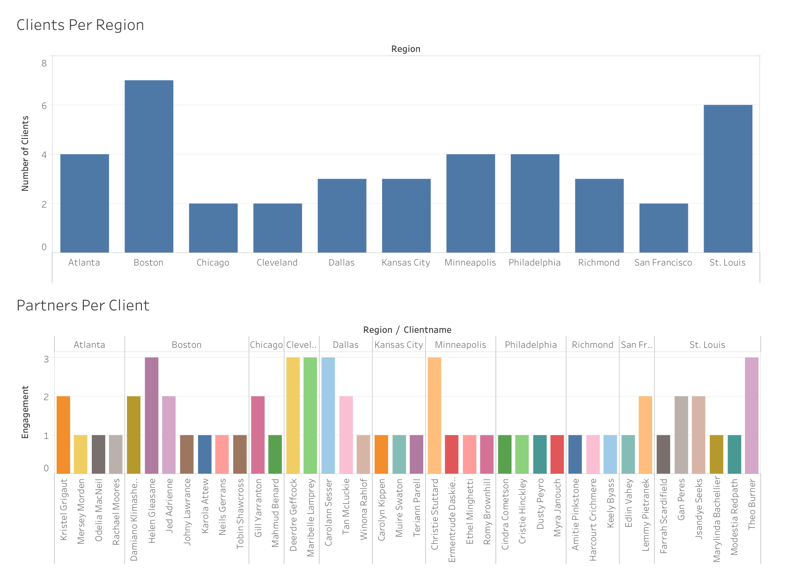
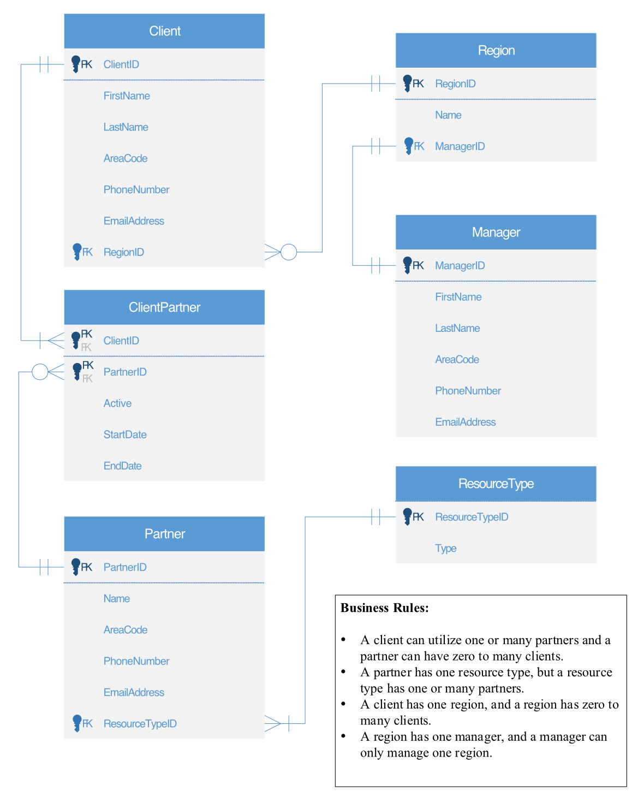

# Nonprofit Client Database (SQL and Tableau)

A transactional database for a nonprofit that connects women leaving abusive relationships with outside support: legal help, housing, childcare, counseling, and more. I took it from requirements to a working database with stored procedures, views, and a Tableau report.

> **About this project:** I built it on my own for ISMG 3500, Business Data and Database Management, at the University of Colorado Denver (Spring 2023). The organization is fictional. Every name, phone number, and email in the sample data is randomly generated. It earned full marks on all six graded parts. I wrote the SQL, the diagram, and the report myself. Claude helped organize this write-up for GitHub.

## The problem

The client, "Women's Aid Group," needed one place to track:

- **Clients**, and which region each one lives in
- **Partner organizations** (lawyers, shelters, counselors, financial advisors) and the type of help each one offers
- **Which clients use which partners**, with start and end dates
- **Regional managers**, so each client knows who to contact

The staff also wanted answers to everyday questions: *How many clients are active? Which kinds of help are most in demand? Is any region overloaded?*

## How I approached it

I ran it like a client engagement, in five steps:

1. **Requirements:** I wrote a [letter of engagement](docs/letter-of-engagement.md) that defines the business, the entities, the business rules, and the queries and reports the client needs.
2. **Data model:** I designed a normalized entity-relationship diagram from those rules (below).
3. **Build:** I created the tables in Oracle SQL Developer with primary and foreign keys, and loaded sample data.
4. **Queries:** I wrote stored procedures and views that answer the client's questions.
5. **Reporting and handoff:** I built a Tableau report on the live data and presented the whole system to the "client."

## Data model

**Business rules**

- A client can use one or many partners, and a partner can have zero to many clients. The `ClientPartner` junction table handles this, with its own `Active`, `StartDate`, and `EndDate` columns.
- A partner has one resource type, and a resource type has one or many partners.
- A client has one region, and a region has zero to many clients.
- A region has one manager, and a manager manages only one region.

**Sample data:** 40 clients, 20 partner organizations, 10 resource types (such as Legal, Housing, Childcare, Mental Health, and Career), 12 regions with 12 managers, and 60 client-to-partner records.

## What the database answers

| Procedure or view | Question it answers | SQL techniques |
|---|---|---|
| `ActiveClients_sp` | Which clients are active right now, and who is their regional manager? | Subquery, multi-table joins |
| `CountClientRegions_sp` | How many clients does each region have? | `GROUP BY`, `COUNT` |
| `CountClientPartner_sp` | How many clients does each partner serve, including partners with none? | `RIGHT OUTER JOIN` |
| `CountClientTypes_sp` | Which kinds of help are most in demand? | Joins across three tables, aggregation |
| `ClientHistory_sp` | What is one client's full history of partners, in order? | Parameterized query |
| `ClientTenure_sp` | Which clients have been with the program for more than two years? | `MAX`, `MIN`, and `NVL` with `HAVING` |
| `ClientPartnerStatus_sp` | Is each client-to-partner relationship active or inactive? | `CASE` |
| `AllContactInfo_sp` | One contact list of every client and manager | `UNION` |
| `InsertClient_sp` | Add a new client | Parameterized `INSERT` |
| `ClientReport_vw` | Client lookup with region, manager, and number of partners used | View with aggregation |
| `PartnerReport_vw` | Partner lookup with contact info and resource type | View |

The [Tableau report](tableau/) uses the client data to show **clients per region**, so staff can balance each manager's workload, and **partners per client**, which shows how much support each person is using.

## Files

| Path | What it is |
|---|---|
| [`sql/womens_aid_group.sql`](sql/womens_aid_group.sql) | The complete script: tables, sample data, stored procedures, views, and a commented-out cleanup block |
| [`tableau/ClientReport.twbx`](tableau/ClientReport.twbx) | Tableau packaged workbook (open in Tableau Desktop or the free Tableau Public) |
| [`tableau/ClientReport.pdf`](tableau/ClientReport.pdf) | The same report as a PDF |
| [`docs/letter-of-engagement.md`](docs/letter-of-engagement.md) | The requirements document I wrote at the start |
| [`docs/images/`](docs/images/) | The diagram and report images used in this README |

## Run it

The script is written for **Oracle** (it uses `VARCHAR2`, `SYS_REFCURSOR`, and `DBMS_SQL.RETURN_RESULT`).

1. Open it in [Oracle SQL Developer](https://www.oracle.com/database/sqldeveloper/) connected to any Oracle database. A free option is Oracle Database Free.
2. Run the whole script as a script (F5). It creates the tables, loads the data, and creates the procedures and views.
3. Try a procedure, for example `EXEC CountClientTypes_sp;`, or a view: `SELECT * FROM ClientReport_vw;`
4. To remove everything, run the `DROP` statements in the commented block at the end of the script.

---

Built by Marcella Green. [LinkedIn](https://www.linkedin.com/in/marcellagreen) · Also see my [HOA records app demo](https://github.com/mgreen-out/hoa-records-demo).
